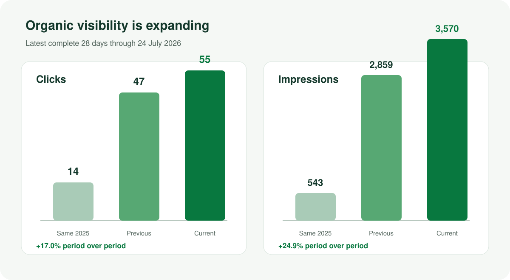
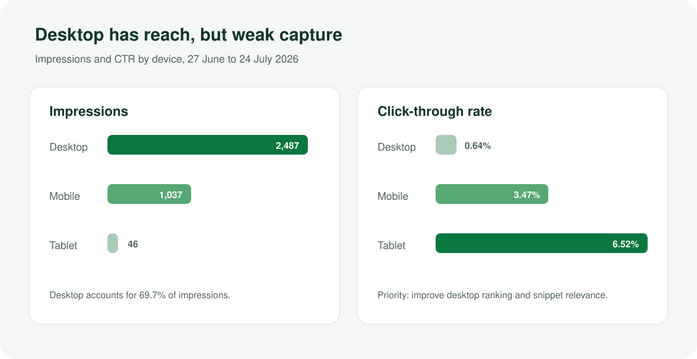

# Report profile

This report translates Google organic-search and measurement data into decisions for Quilliams Mowing. It is focused on what Google has indexed, where visibility is growing, why existing impressions are not producing more visits, and what must be repaired before lead performance can be measured reliably.

| Report field | Value |
|---|---|
| Domain | quilliamsmowing.co.uk |
| Report date | 27 July 2026 |
| Search Console data through | 24 July 2026 |
| GA4 data through | 26 July 2026 |
| Search Console property | `sc-domain:quilliamsmowing.co.uk` |
| GA4 property | `501971583` |
| Inputs | Search Analytics, URL Inspection, Sitemaps, GA4, Lighthouse, and production browser tests |

Scores are decision aids rather than Google-issued grades. "Strong" means the available evidence is healthy; "needs improvement" identifies a material growth constraint; "poor" means the data or implementation cannot yet support normal decisions; "unknown" means no defensible verdict was available.

# Executive briefing

Quilliams has a sound Google organic foundation and rapidly expanding visibility. The latest complete 28-day Search Console period produced 55 clicks and 3,570 impressions. Clicks rose 17.0% from the previous period and 292.9% year over year. Impressions rose 24.9% period over period and 557.5% year over year.

The current constraint is conversion of visibility into qualified visits and trustworthy measurement:

1. Average position moved from 18.9 to 22.5 as Google tested the site for a wider set of lower-ranked queries.
2. CTR declined slightly from 1.64% to 1.54%.
3. Desktop generated 69.7% of impressions but only 29.1% of clicks.
4. Lawn-care and hedge-trimming pages earned hundreds of impressions at less than 0.30% CTR.
5. GA4 recorded one organic session during a near-overlapping period in which Search Console recorded 55 clicks.

There is no evidence of a broad Google indexation problem. Twelve representative URL Inspection checks passed, Google selected the declared canonical in every sample, and the submitted sitemap reports zero errors and zero warnings.

## Management scorecard

| Area | Score | Status | Management interpretation |
|---|---:|---|---|
| Search performance | 68/100 | Needs improvement | Strong growth, but rankings and CTR need consolidation |
| Indexation and sitemap | 95/100 | Strong | No sample-level indexing or canonical failures |
| GA4 measurement reliability | 15/100 | Poor | Organic and lead reporting cannot yet support decisions |
| Google field Core Web Vitals | Not available | Unknown | PSI/CrUX API key or quota was unavailable |
| Lab performance | 64/100 | Needs improvement | Mobile runtime is heavy and test methods disagree |

## Decisions for the next 30 days

- Repair and validate GA4 before using it for landing-page or conversion decisions.
- Assign one preferred page to each valuable query cluster.
- Improve titles, opening copy, internal links, and snippet relevance for service pages already earning impressions.
- Preserve the strong indexation foundation while correcting unreliable sitemap `lastmod` values.
- Reduce optional third-party work on mobile, then obtain repeatable lab results and field data.

# Organic search growth

{width=full}

## Period comparison

| Metric | 27 Jun-24 Jul 2026 | Previous 28 days | Change | Same period 2025 | YoY change |
|---|---:|---:|---:|---:|---:|
| Clicks | 55 | 47 | +17.0% | 14 | +292.9% |
| Impressions | 3,570 | 2,859 | +24.9% | 543 | +557.5% |
| CTR | 1.54% | 1.64% | -0.10 pp | 2.58% | -1.04 pp |
| Average position | 22.5 | 18.9 | 3.6 positions worse | 26.7 | 4.2 positions better |

The wider impression footprint is positive. The weaker average position is consistent with new lower-ranked query exposure, not with a sitewide de-indexing event. The operating goal is to move high-relevance impressions into positions 1-10 while protecting existing strong local queries.

The United Kingdom supplied 3,304 of 3,570 impressions and all 55 clicks, which confirms that current organic demand is geographically relevant.

# Device opportunity

{width=full}

| Device | Clicks | Impressions | CTR | Average position |
|---|---:|---:|---:|---:|
| Mobile | 36 | 1,037 | 3.47% | 7.9 |
| Desktop | 16 | 2,487 | 0.64% | 28.9 |
| Tablet | 3 | 46 | 6.52% | 7.0 |

Desktop is the largest opportunity. It supplies the most impressions, but its average position and CTR lag mobile materially. This does not prove a desktop technical defect. It points first to query mix, target-page ownership, ranking depth, and snippet relevance.

Recommended analysis:

- Segment desktop queries by page and intent.
- Identify queries with positions 8-20 and meaningful impressions.
- Compare the desktop result title and snippet with local competitors.
- Test whether the correct service page, rather than the homepage or comparison blog, owns each query.

# Landing-page performance

| Landing page | Clicks | Impressions | CTR | Position | Priority |
|---|---:|---:|---:|---:|---|
| `/` | 30 | 1,101 | 2.72% | 17.4 | Protect and clarify broad local-service ownership |
| `/blog/best-gardeners-newquay` | 8 | 618 | 1.29% | 15.2 | Keep comparative; link decisively to commercial pages |
| `/services/lawn-care` | 1 | 384 | 0.26% | 18.9 | High |
| `/services/hedge-trimming` | 1 | 350 | 0.29% | 34.1 | High |
| `/areas/st-columb-major` | 1 | 275 | 0.36% | 17.7 | Medium |
| `/services/landscaping` | 2 | 273 | 0.73% | 47.9 | High |
| `/areas/newquay` | 2 | 248 | 0.81% | 28.1 | High |
| `/services` | 0 | 247 | 0.00% | 49.8 | Medium |
| `/pricing` | 3 | 215 | 1.40% | 15.4 | Protect and improve internal visibility |

The homepage still supplies most organic clicks, but it lost five clicks and 141 impressions against the previous period while several inner pages expanded. That is an expected transition for a growing site, provided individual landing pages are given distinct roles.

## Page-level actions

### Lawn care

- Primary intent: `lawn care cornwall`, `cornwall mowing`, and local mowing queries.
- Add query-specific proof, service inclusions, price route, and location context near the opening.
- Link from pricing, relevant area pages, and the lawn-care guide with descriptive anchors.
- Rewrite the title and description for service, location, proof, and action.

### Hedge trimming

- Primary intent: `hedge trimming cornwall`.
- Strengthen the dedicated service page instead of allowing the homepage and informational article to share the main service intent.
- Use the timing/cost article as supporting content with a clear commercial link.
- Clarify that agricultural hedge cutting is not offered if that remains true.

### Landscaping

- Primary intent: `garden design newquay` and relevant landscaping queries.
- Repoint internal links from the comparison article, projects, and homepage.
- Bring design process, local proof, and quote path into the first screen of content.

### Newquay and St Agnes

- Use `/areas/newquay` for local gardener and recurring maintenance intent.
- Use `/areas/st-agnes` for `garden maintenance st agnes`.
- Keep the homepage focused on broad brand and near-me demand.

# Query opportunities

Search Console exposed 205 query rows, but privacy thresholds mean those rows contain only 14 clicks and 1,064 impressions. Query totals are therefore directional and cannot be added to the property total.

| Query | Clicks | Impressions | CTR | Position | Preferred response |
|---|---:|---:|---:|---:|---|
| `garden design newquay` | 0 | 59 | 0.00% | 9.3 | Consolidate on landscaping service page |
| `garden maintenance st agnes` | 0 | 18 | 0.00% | 6.7 | Improve St Agnes area snippet and internal links |
| `cornwall mowing` | 0 | 20 | 0.00% | 9.1 | Strengthen lawn-care page |
| `lawn care cornwall` | 0 | 70 | 0.00% | 20.1 | Build service relevance and proof |
| `agricultural hedge cutting newquay` | 0 | 76 | 0.00% | 15.6 | Validate intent; do not target an unoffered service |
| `hedge trimming cornwall` | 1 | 91 | 1.10% | 40.2 | Consolidate commercial intent |
| `gardener newquay` | 2 | 36 | 5.56% | 4.4 | Protect |
| `garden services near me` | 3 | 33 | 9.09% | 5.8 | Protect |
| `gardeners newquay` | 2 | 32 | 6.25% | 6.9 | Protect while separating comparison intent |

The quickest gains are not new pages. They are clearer page ownership, better internal anchors, stronger first-screen relevance, and more compelling snippets on pages Google already displays.

# Indexation and sitemap

## URL Inspection

Twelve representative URLs were inspected through Google Search Console:

| Check | Result |
|---|---:|
| URLs inspected | 12 |
| Verdict PASS | 12 |
| Submitted and indexed | 12 |
| Robots allowed | 12 |
| Successful fetch | 12 |
| Crawled as mobile | 12 |
| Google canonical matched declared canonical | 12 |

The sample included the homepage, main service pages, pricing, priority location pages, and leading blog content. Recorded crawl dates ranged from 3 to 27 July 2026.

Review-snippet processing passed on the homepage and Breadcrumb processing passed on sampled inner pages. A successful enhancement verdict means Google understood the markup. It does not guarantee a special search result.

## Sitemap

| Sitemap signal | Result |
|---|---|
| URL | `https://quilliamsmowing.co.uk/sitemap.xml` |
| Submitted URLs | 37 |
| Last submitted | 8 February 2026 |
| Last downloaded | 26 July 2026, 18:00 UTC |
| Pending | False |
| Warnings | 0 |
| Errors | 0 |

The sitemap API reports an `indexed: 0` field that conflicts directly with the 12 live URL Inspection passes. It must be treated as stale or unavailable, not as evidence that zero pages are indexed.

The actionable sitemap issue is `lastmod`. Current dates cluster around a few 4 July timestamps and disagree with Article `dateModified` on all eight blogs. Generate `lastmod` from the actual content date or omit it when no reliable date exists.

# GA4 measurement integrity

GA4 cannot currently represent organic acquisition reliably.

## Diagnostic result

| Metric | Result |
|---|---:|
| Organic sessions | 1 |
| Total sessions | 19 |
| Users | 12 |
| Pageviews | 46 |
| Direct sessions | 17 |
| Unassigned sessions | 1 |
| Key events | 1 `generate_lead` |
| Supporting events | 2 `form_start`, 1 `click_whatsapp` |

No sessions were collected from 3 January through 5 July 2026, a 184-day gap. Collection resumed on 6 July. The correct GA4 measurement ID is currently present on production.

Search Console clicks and GA4 sessions are different metrics, but 55 clicks against one organic session is too large a gap to use GA4 as a representative organic source.

## Required repair sequence

1. Review deployment history and analytics changes around 6 July.
2. Verify consent defaults and consent updates before and after user choice.
3. Confirm the first `page_view` and subsequent navigation events.
4. Test attribution in DebugView for Google organic, direct, and referral visits.
5. Test accepted and denied consent paths separately.
6. Validate quote submission, phone, email, and WhatsApp events.
7. Mark only true business outcomes as key events.
8. Compare GSC clicks, GA4 organic sessions, and consent rate for 14 days.

Until this passes, use Search Console for organic trend reporting and do not use GA4 to compare landing-page engagement or conversion.

# Performance and Core Web Vitals

Google field Core Web Vitals were unavailable because PSI/CrUX API access or quota was unavailable. INP was not inferred. The following is lab evidence only.

## Standard Lighthouse 13.4.1

| Metric | Mobile | Desktop |
|---|---:|---:|
| Performance score | 59 | 73 |
| Accessibility | 97 | 97 |
| Best practices | 100 | 100 |
| SEO | 100 | 100 |
| FCP | 3.7 s | 2.4 s |
| LCP | 5.4 s | 2.4 s |
| Speed Index | 8.6 s | 2.8 s |
| Total Blocking Time | 280 ms | 0 ms |
| CLS | 0.024 | 0.004 |
| Time to Interactive | 16.4 s | 2.4 s |
| Transfer size | 2,569 KiB | 2,016 KiB |

The mobile LCP element was the server-rendered hero H1, not the hero image. Lighthouse attributed about 2.39 seconds to element render delay. Priority should therefore go to critical CSS, font display, animation, hydration, and optional runtime before adding image preloads.

Lighthouse estimated about 195 KiB of unused JavaScript and 194 KiB of mobile image-delivery savings. GTM, optional PostHog modules, and Cloudflare Turnstile were material runtime contributors.

Three separate applied-throttling mobile browser runs produced a 2.092-second median LCP and 0.023 median CLS. Because the test methods disagree, the responsible verdict is "stabilise and obtain field data," not a declared pass or fail.

Google's current Core Web Vitals guidance evaluates LCP, INP, and CLS using real-user data where available: [Core Web Vitals documentation](https://developers.google.com/search/docs/appearance/core-web-vitals).

# 90-day Google SEO programme

## Days 1-14: restore measurement and ownership

- Repair GA4 consent, pageview, attribution, and lead events.
- Assign primary queries to homepage, area, service, and comparison pages.
- Fix `/refer` rendering or remove it from organic indexing.
- Approve the local entity source of truth.

Success criteria:

- DebugView and Realtime tests pass.
- Each priority query has one documented owner page.
- `/refer` has useful initial HTML or a deliberate `noindex`.

## Days 15-30: improve capture and mobile stability

- Rewrite priority service-page titles, descriptions, H1/opening copy, and internal anchors.
- Defer optional PostHog modules and conditionalise Turnstile.
- Reduce H1 render delay.
- Correct sitemap `lastmod`.

Success criteria:

- Three-run Lighthouse variance narrows and median mobile LCP improves.
- Lawn-care, hedge-trimming, landscaping, Newquay, and St Agnes pages have unambiguous roles.
- Page/query/device CTR baselines are recorded.

## Days 31-60: strengthen evidence

- Add primary sources and evidence tables to priority editorial content.
- Improve the comparison article's methodology and direct citations.
- Add genuine local project evidence to priority location pages.
- Reconcile live consumer citations.

Success criteria:

- Factual editorial claims are source-backed.
- Local entity facts agree across site, schema, map, and controlled listings.

## Days 61-90: measure outcome

- Compare latest 28 days with the previous 28 days in GSC.
- Review top-10 growth, CTR, landing-page clicks, and qualified lead events.
- Obtain PSI/CrUX field data if access becomes available.
- Re-inspect a representative URL sample.

Success criteria:

- High-impression service pages improve CTR and/or average position.
- GA4 is credible enough for landing-page and conversion analysis.
- Indexation and canonical pass rates remain intact.

# KPI dashboard

| KPI | Source | Baseline | Review cadence |
|---|---|---:|---|
| Organic clicks | GSC | 55 per latest complete 28 days | Monthly |
| Organic impressions | GSC | 3,570 | Monthly |
| CTR | GSC | 1.54% | Monthly |
| Average position | GSC | 22.5 | Monthly |
| Desktop CTR | GSC | 0.64% | Monthly |
| Lawn-care CTR | GSC | 0.26% | Monthly |
| Hedge-trimming CTR | GSC | 0.29% | Monthly |
| URL Inspection pass sample | GSC | 12/12 | Quarterly and after structural changes |
| Organic sessions | GA4 | 1, unreliable | Weekly until repaired |
| Verified lead events | GA4 | 1, requires validation | Weekly until repaired |
| Mobile Lighthouse | Lab | 59, single standard run | After each performance release |

No ranking or traffic outcome is guaranteed. The programme should be judged by movement into top-10 positions, stronger CTR on high-impression pages, and reliable qualified-lead measurement.

# Data freshness and limitations

- Search Console final data runs through 24 July 2026 and follows Google's normal processing lag.
- GA4 data runs through 26 July 2026 and has a one-day freshness lag.
- Search Console query rows are privacy-filtered and non-additive.
- The 12-URL Inspection result is a representative sample, not a claim about every indexed URL.
- The sitemap API indexed count conflicts with live URL Inspection and was not used.
- GA4 has a severe collection gap and is not representative.
- PSI/CrUX field data was unavailable.
- Lighthouse and applied-throttling tests are lab measurements, not field Core Web Vitals.
- No Google Business Profile dashboard or local-pack rank grid was available.

## Sources

- Google Search Console Search Analytics, URL Inspection, and Sitemaps APIs for `sc-domain:quilliamsmowing.co.uk`
- Google Analytics Data API for property `501971583`
- [Quilliams XML sitemap](https://quilliamsmowing.co.uk/sitemap.xml)
- [Quilliams robots file](https://quilliamsmowing.co.uk/robots.txt)
- [Google Search Central Core Web Vitals guidance](https://developers.google.com/search/docs/appearance/core-web-vitals)
- Production Lighthouse 13.4.1 and applied-throttling browser tests collected on 27 July 2026
